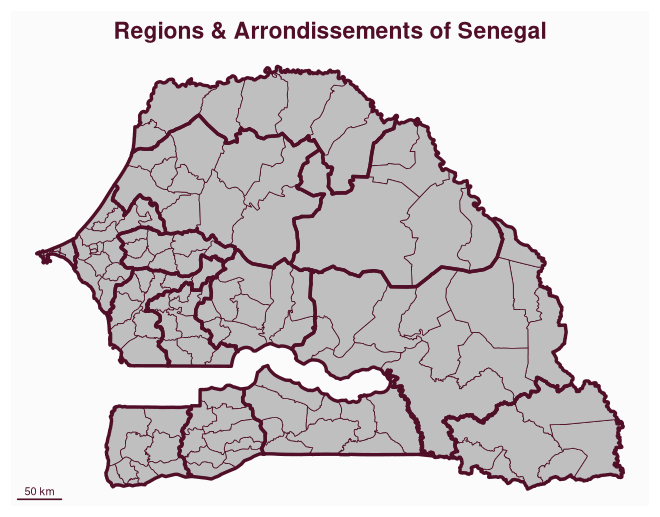
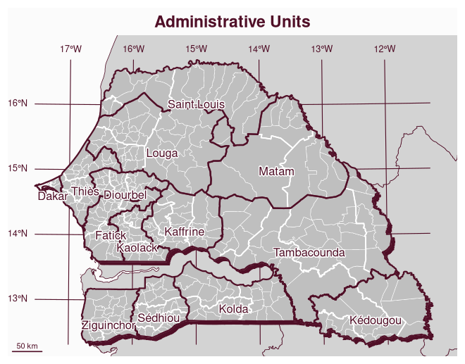
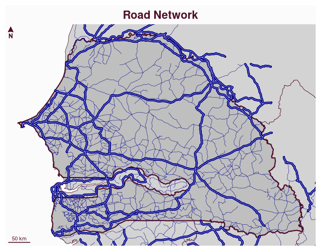
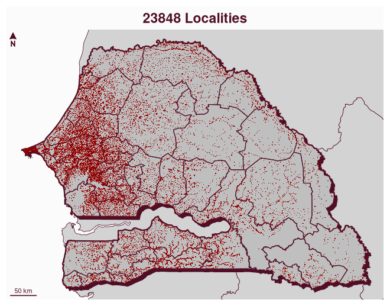
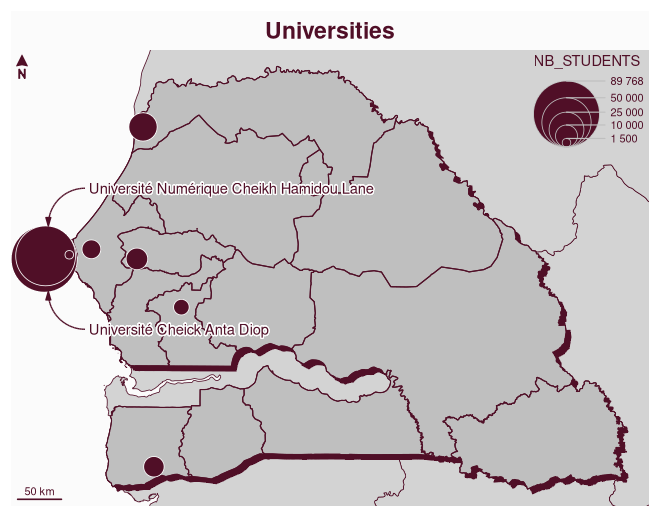
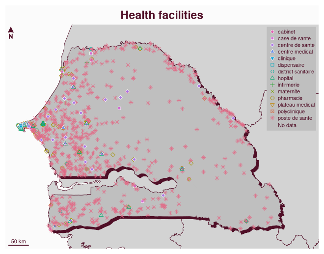

<!-- README.md is generated from README.Rmd. Please edit that file -->

# mapSenegal 

<!-- badges: start -->

<!-- badges: end -->

The goal of `mapSenegal` is to provides access to administrative
boundaries of Senegal at several levels (regions, departements,
arrondissements and communes), These boundaries are based on ‘GDAM’. The
package also gives access to roads, localities, universities and health
facilities locations.

## Installation

You can install the development version of `mapSenegal` with:

``` r
# install.packages("remotes")
remotes::install_github("rCarto/mapSenegal")
```

## Examples

This is a basic example which shows you how to use the package.

``` r
library(mapSenegal)
#> Loading required package: sf
#> Linking to GEOS 3.13.1, GDAL 3.10.3, PROJ 9.6.0; sf_use_s2() is TRUE
library(mapsf)
reg <- sn_regions()
ardt <- sn_arrondissements()
mf_map(ardt)
mf_map(reg, col = NA, lwd = 3, add = TRUE)
mf_scale(pos = "bottomleft")
mf_title("Regions & Arrondissements of Senegal")
```

<!-- -->

The following maps shows the different layers provided by the package.

``` r
# import
pays <- sn_country()
zone <- sn_neighbors()
reg <- sn_regions()
dep <- sn_departments()
ardt <- sn_arrondissements()
com <- sn_communes()
loc <- sn_localities()
hf <- sn_health_facilities()
univ <- sn_universities()
roads <- sn_roads()

mf_map(pays, col = NA, border = NA, expandBB = c(0,0,.05,0))
mf_map(zone, col = "lightgrey", add =  TRUE)
mf_shadow(pays, add = TRUE)
mf_graticule(pays, add = T)
mf_map(com, lwd = .5, add = TRUE, border = 0)
mf_map(dep, lwd = 1.5, add = TRUE, col = NA, border = 0)
mf_map(reg, col = NA, lwd = 2, add = TRUE)
mf_label(reg, "NAME", halo = TRUE, cex = .9, pos = 1)
mf_scale(pos = "bottomleft")
mf_title("Administrative Units")
```

<!-- -->

``` r

mf_map(pays, col = NA, border = NA)
mf_map(zone, col = "lightgrey", add =  TRUE)
mf_map(pays, lwd = 2, add = TRUE)
mf_map(subset(roads, TYPE %in% 4:5), col = "darkblue", lwd = .5, add = TRUE)
mf_map(subset(roads, TYPE %in% 1:3), col = "darkblue", lwd = 4, add = TRUE)
mf_map(subset(roads, TYPE %in% 1:3), col = "white", lwd = .5, add = TRUE)
mf_arrow()
mf_scale(pos = "bottomleft")
mf_title("Road Network")
```

<!-- -->

``` r

mf_map(pays, col = NA, border = NA)
mf_map(zone, col = "lightgrey", add =  TRUE)
mf_shadow(pays, add = TRUE)
mf_map(pays, lwd = 2, add = TRUE)
mf_map(dep, col = NA, lwd = 1, add = TRUE)
mf_map(loc, pch = ".", col = "#940000", add = TRUE)
mf_arrow()
mf_scale(pos = "bottomleft")
mf_title(paste0(nrow(loc), " Localities"))
```

<!-- -->

``` r

mf_map(pays, col = NA, border = NA)
mf_map(zone, col = "lightgrey", add =  TRUE)
mf_shadow(pays, add = TRUE)
mf_map(pays, add = TRUE)
mf_map(reg, col = NA, lwd = 1, add = TRUE)
mf_map(univ, "NB_STUDENTS", "prop", leg_val_big = " ")
mf_annotation(x = c(239471, 1655820), 
                            txt = "Université Numérique Cheikh Hamidou Lane", halo = T)
mf_annotation(c(239471, 1595149), 
                            txt = "Université Cheick Anta Diop", halo = T, pos = "bottomright")
mf_arrow()
mf_scale(pos = "bottomleft")
mf_title("Universities")
```

<!-- -->

``` r

mf_map(pays, col = NA, border = NA, expandBB = c(0,0,0,.1))
mf_map(zone, col = "lightgrey", add =  TRUE)
mf_shadow(pays, add = TRUE)
mf_map(pays, add = TRUE)
mf_map(hf, var = "TYPE", type = "symb", cex = .75, 
             pal = "Dark 3", add = TRUE, leg_title = "",
             leg_pos = "topright", leg_frame = TRUE)
mf_arrow()
mf_scale(pos = "bottomleft")
mf_title("Health facilities")
```

<!-- -->
