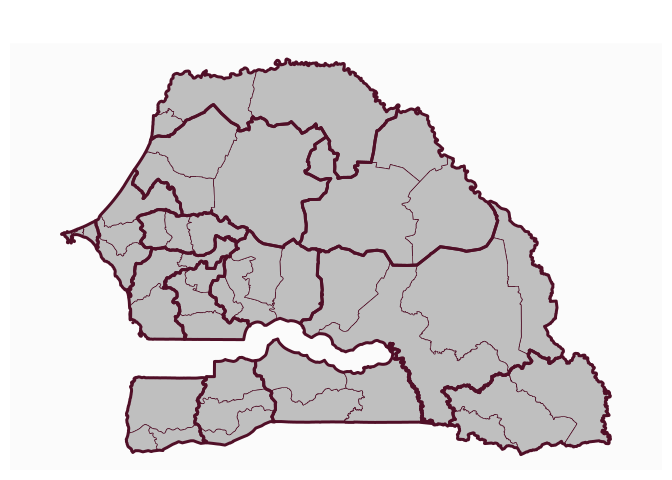

<!-- README.md is generated from README.Rmd. Please edit that file -->

# mapSenegal - Administrative Boundaries of Senegal

<!-- badges: start -->

<!-- badges: end -->

The goal of mapSenegal is to provides access to administrative
boundaries of Senegal at several levels (regions, departements,
arrondissements and communes), These boundaries are based on ‘GDAM’. The
package also gives access to localities, universities, roads and health
facilities locations. base maps and

## Installation

You can install the development version of mapSenegal with:

``` r
# install.packages("remotes")
remotes::install_github("rCarto/mapSenegal")
```

## Example

This is a basic example which shows you how to solve a common problem:

``` r
library(mapSenegal)
#> Loading required package: sf
#> Linking to GEOS 3.13.1, GDAL 3.10.3, PROJ 9.6.0; sf_use_s2() is TRUE
library(mapsf)
reg <- sn_regions()
dep <- sn_departments()
mf_map(dep)
mf_map(reg, col = NA, lwd = 3, add = TRUE)
```


